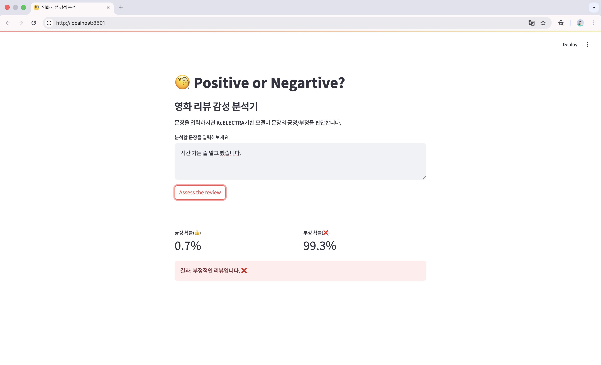
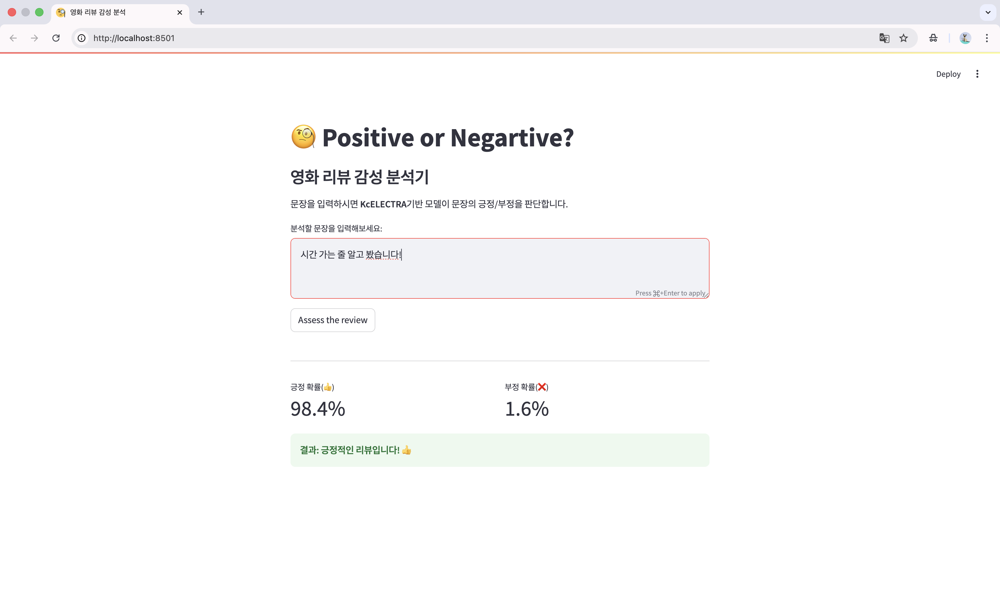
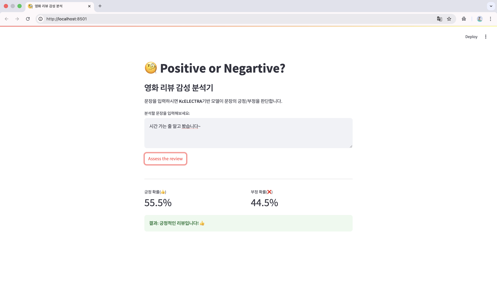

#Ko-ELECTRA 기반 한국어 리뷰 감성 분석기
 
 
 


### 개요
한국어 구어체와 신조어가 섞인 영화 리뷰 데이터를 분석하여, 긍정과 부정을 판별하는 AI 웹 서비스를 구현해 봤습니다. Transformer 기반의 ELECTRA 아키텍처를 이용한 KcELECTRA 모델을 파인튜닝하여 구현했습니다.

---

### 개발 동기
이전에 LSTM을 활용한 시계열 데이터를 다뤄본 경험이 있습니다. 이번에는 최신 NLP 분야의 기초인 Attention 메커니즘과 사전 학습 모델의 효용성을 직접 확인해 보기 위해 기획했습니다. 데이터 수집과 전처리, 모델 학습, 웹 서비스 배포의 기초적인 딥러닝의 파이프 라인을 체험해 보고자 했습니다.

---

### 사용된 기술
* **Model:** `beomi/KcELECTRA-base` (한국어 댓글 데이터로 사전 학습된 모델 사용) 
* **Data:** Naver Sentiment Movie Corpus (NSMC) 
* **Library:** PyTorch, Hugging Face Transformers, Pandas, Scikit-learn 
* **Deployment:** Streamlit (웹 대시보드 구현) 
* **Environment:** Mac OS (MPS Acceleration) / Google Colab

---

###  프로젝트 구조
1. **Data Load:** `nsmc` 데이터셋 로드 (학습 속도 최적화를 위해 일부 샘플링 사용) 
2. **Tokenization:** KcELECTRA 토크나이저 활용 (Max Length: 128) 
3. **Fine-tuning:** 
* Pre-trained 모델의 가중치를 가져와 영화 리뷰 데이터에 맞게 미세 조정 
* Mac M-series 칩셋의 `MPS` 가속 활용하여 로컬 학습 환경 구축 
4. **Serving:** Streamlit을 활용해 사용자가 텍스트를 입력하면 확률을 시각화하여 반환 

---

### 트러블 슈팅
 **1. 라이브러리 버전 호환성 문제 (Dependency Conflict)** 
* **문제:** `datasets` 라이브러리 업데이트로 인해 `load_dataset` 함수가 보안 정책상 스크립트 실행을 차단함. 
* **해결:** `wget`을 사용하여 원본 데이터를 직접 다운로드하고, `pandas`로 로드하여 `Dataset` 객체로 변환하는 방식으로 우회하여 파이프라인 안정성을 확보함. 
**2. Mac OS(Apple Silicon) 가속 설정** 
* **문제:** 일반적인 `cuda` 설정이 Mac 환경에서 작동하지 않음. 
* **해결:** `torch.backends.mps.is_available()` 체크 로직을 추가하여, Mac 환경에서는 `mps` 장치를 사용하고 그 외에는 CPU를 사용하도록 호환성을 높임. 
**3. Hugging Face API 변경 대응**
* **문제:** `TrainingArguments`의 `evaluation_strategy` 파라미터가 최신 버전에서 `eval_strategy`로 변경되어 에러 발생. 
* **해결:** 공식 문서를 참고하여 최신 API 규격에 맞게 파라미터명을 수정함. ---

---

### 실행 화면
 







---

### 결과 분석 및 한계
* **애매한 문장 처리 : ** “연출은 좋은데 배우의 연기가 아쉽다”와 같은 복합적인 감정은 문장의 뒷부분에만 영향을 받는 경향이 있습니다. 이를 해결하기 위해 Aspect-Based Sentiment Analysis(ABSA) 기법을 도입해보고 싶습니다. 
* **문장 부호 처리 : ** 같은 문장이라도 느낌표, 물결표, 마침표와 같은 문장 부호의 종류에 따라 다른 감성으로 분류됩니다.
* **비꼼 해석 : **”시간 가는 줄 알고 봤습니다”와 같이 기존의 칭찬 표현을 비틀어 비꼬는 문장의 해석을 잘 해냅니다. 하지만 위의 문장 부호 처리에 영향을 받는 것이 확인됩니다.
* **감독 평판 : ** ‘봉준호’, ‘홍상수’, ‘김기덕’과 같이 감독 이름만 입력하였을 때 인터넷 평판이 반영되어 긍정과 부정이 판단되는 것이 흥미로웠습니다.
* **데이터 부족 : ** 빠른 프로토타이핑을 위해 전체 데이터 중 일부(1만 5천 개)만 사용하여 학습했습니다. 추후 전체 데이터(15만 개)를 학습시키면 정확도가 대폭 향상될 것으로 기대합니다. 

---


### 설치 및 실행 방법
```bash # 1. 라이브러리 설치 pip install -r requirements.txt 
# 2. 웹 애플리케이션 실행 streamlit run app.py
